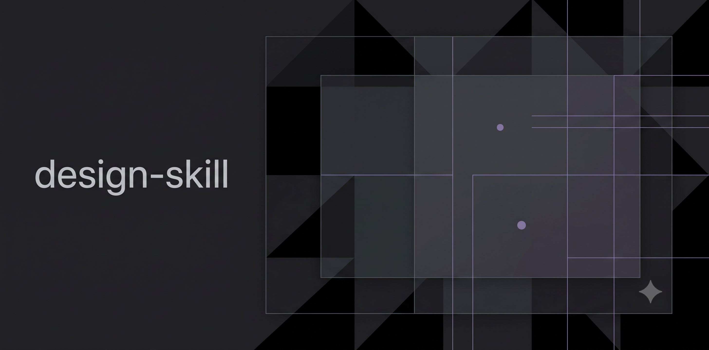

<p align="center">
  
</p>

# Design Skill

[](https://www.npmjs.com/package/agent-design-skill)

Every AI-generated interface has a tell. The identical card grid. The purple-blue gradient. The hero that reads like a template. Two seconds of looking and you know a model made it. This skill exists to make that reaction impossible.

New here? Start with [Using the Design Skill](GUIDE.md), a walkthrough of the skill in practice.

## What v2 changes

v1 was a fork of [pbakaus/impeccable](https://github.com/pbakaus/impeccable): 55 reference files, 30 routed commands, a live browser subsystem, and zero measurement. The baseline proved it did not kill slop: with the skill loaded, models still produced gradient heroes and identical card grids, and build-from-brief got *worse*.

v2 is a rebuild measured by [agent-skills-eval](https://github.com/darkrishabh/agent-skills-eval): SKILL.md teaches 10 tells with positive direction, five commands, grilling-first planning, and an on-demand eval scorecard. See [evals/BASELINE-v1.md](evals/BASELINE-v1.md) and [evals/BASELINE-v2.md](evals/BASELINE-v2.md).

## Five commands

| Command | Flags | What it does |
|---------|-------|--------------|
| `detect` | (script) | Run `node scripts/detector.mjs <target>`; report mechanical tells |
| `audit` | `--a11y --responsive --interaction --checkup --polish` | Two-axis scored audit (Standards x Spec, parallel passes, no reranking) into `.design-skill/audit-report.md`, with a /24 health score |
| `deslop` | `--distill --bolder --quieter --harden` | Kill slop tells with positive alternatives, not removals |
| `shape` | (grill) | Interview before building: frontier rounds, every question carries a recommendation; settle register, mode, persona, direction, then a confirmed brief |
| `craft` | `--typeset --colorize --layout --animate --document` | Brief-confirmed build; flags apply the matching doctrine; `--document` writes and validates DESIGN.md (google-labs-code/design.md format) |

Abilities are flags, never standalone commands. Say what you want in plain words: "this looks like AI made it" becomes an audit then a deslop; "build me a landing page" becomes a shape grill then a craft.

## Two invocation modes

- **Model-invoked.** When UI is in view (screenshot, artifact, live page), the skill flags visible tells in one line and offers the matching command; when HTML is reachable it runs `detect`.
- **User-invoked.** `shape` and `craft` grill before building, never assume (the grilling protocol is borrowed from [Matt Pocock's skills](https://github.com/mattpocock/skills)). `audit` and `deslop` accept a target.

## The 10 tells

Tech gradient, generic tech hue, feature-tile grid, accent rail, unearned blur, stat monument, icon topper, template hero, default type stack, anti-reference echo. Each tell names why it reads machine-made and what to do instead (positive direction, not bans). The full table lives in [SKILL.md](SKILL.md).

## Design laws in brief

- **Modes.** Persuade (decide and act), Operate (complete a task), Read (understand), Experience (be inside the work). Choose from the surface, not the category: a tool's landing page still persuades.
- **Register.** Brand (design IS the product) or product (design SERVES the product). Each has its own slop test, type and color stances, permissions and bans (reference/register.md).
- **Type.** Body measure 60-76ch, >= 1.25x scale, editorial contrast over flat stacks. Reject the training-data defaults (Inter, Fraunces, Space Grotesk and friends) on greenfield brand work.
- **Color.** OKLCH-first, hue chosen with reason. Palette is voice on brand surfaces; restrained with a state vocabulary on product surfaces.
- **Motion.** One authored moment per surface; purpose-gated; 150-250ms in product UI. Reference directions come from the motionsites.ai free gallery before animating.
- **Interaction.** States everywhere (hover, focus, active, disabled, loading, error, empty), touch targets 44x44px, keyboard paths, no hover-only functionality.
- **Copy.** The product's own language: controls name their action, errors name the problem and the recovery. No em dashes, no filler, no promotional words.
- **Design.md.** `craft --document` writes a DESIGN.md in the google-labs-code/design.md spec (frontmatter tokens + 8 ordered sections) and validates it with `node scripts/design.mjs validate DESIGN.md`.

## Evals

The skill is measured, not assumed. Run the scorecard on demand (not in CI):

```bash
npm run eval
```

66 evals across slop-kill (including 11 real specimens from impeccable's antipattern-examples and 35 tell fragments from killaislop.com), build-from-brief, redesign, two-axis audit, a11y, deslop, shape-grill, goal, and checklist families, run with_skill vs without_skill against the [agent-skills-eval](https://github.com/darkrishabh/agent-skills-eval) harness. Default backend: opencode go (`deepseek-v4-flash`, `https://opencode.ai/zen/go/v1`), key in `.eval-key.go.env` (gitignored; the opencode account key, same one the free tier uses) or `EVAL_API_KEY`. Override with `OPENAI_COMPATIBLE_BASE_URL` / `OPENAI_COMPATIBLE_MODEL` / `OPENAI_COMPATIBLE_API_KEY`. Scorecards: [evals/BASELINE-v1.md](evals/BASELINE-v1.md), [evals/BASELINE-v2.md](evals/BASELINE-v2.md), [evals/BASELINE-SPECIMENS.md](evals/BASELINE-SPECIMENS.md).

Other backends: `npm run eval:zen` runs the same suite on the opencode zen free tier (`deepseek-v4-flash-free`, same key) - caveat: it rate-limits (HTTP 429 FreeUsageLimitError) after ~4-5 heavy calls, so it is for spot runs only; `npm run eval:deepseek` runs it on the DeepSeek API directly (`deepseek-v4-flash`, key in `.eval-key.env`).

## Install

### With skills.sh (recommended)

```bash
npx skills@1.5.22 add TudeOrangBiasa/design-skill
```

Project scope (default) lands in the agent's project skills path (`.pi/skills/`, `.agents/skills/`, `.claude/skills/`, depending on the agent). Add `-g` for a global install into the agent's user skills root:

| Agent | Global install command |
|-------|------------------------|
| Pi | `npx skills@1.5.22 add TudeOrangBiasa/design-skill -a pi -g` |
| OpenCode | `npx skills@1.5.22 add TudeOrangBiasa/design-skill -a opencode -g` |
| Claude Code | `npx skills@1.5.22 add TudeOrangBiasa/design-skill -a claude-code -g` |
| Codex | `npx skills@1.5.22 add TudeOrangBiasa/design-skill -a codex -g` |
| Cursor | `npx skills@1.5.22 add TudeOrangBiasa/design-skill -a cursor -g` |
| Gemini CLI | `npx skills@1.5.22 add TudeOrangBiasa/design-skill -a gemini-cli -g` |
| Shared `.agents/skills` agents | `npx skills@1.5.22 add TudeOrangBiasa/design-skill -a universal -g` |

From a local checkout, the plugin script wraps the same commands and covers omp, which skills.sh has no entry for:

```bash
bash plugins/install.sh pi       # global Pi install
bash plugins/install.sh omp      # symlink into ~/.agents/skills/
bash plugins/install.sh project  # into this repo's .agents/skills/
```

### omp (example harness)

omp discovers authored skills one level under a `skills/` root: `<skills-root>/<skill-name>/SKILL.md`. The canonical user-level root is `~/.agents/skills/` (the `agents` provider, enabled by default). One symlink installs it:

```bash
ln -sfn "$PWD" ~/.agents/skills/design-skill   # run from the repo root
```

### From npm

```
npm install agent-design-skill
```

Point your agent at `node_modules/agent-design-skill/SKILL.md`, or symlink it into your agent's skills directory. Restart your agent afterwards.

### Tooling

The skill ships zero servers, no MCP, and no browser automation. Every automation is a dependency-free Node CLI script under `scripts/`, invoked per run: `node scripts/detector.mjs <target>`, `node scripts/load-context.mjs`, `node scripts/design.mjs validate DESIGN.md`, `node scripts/concept-seed.mjs`. Any harness gets the same tools with nothing to configure beyond Node >= 18.

## Sources

| Source | Contribution |
|--------|-------------|
| [pbakaus/impeccable](https://github.com/pbakaus/impeccable) | Detector lineage, craft-floor, modes doctrine |
| [Emil Kowalski's skills](https://github.com/emilkowalski/skills) | Mistake-catalog method: tell, why, fix |
| CommandCode design | 10-tell slop theory (the teaching core) |
| [Matt Pocock's skills](https://github.com/mattpocock/skills) | Grilling protocol (shape) and two-axis review (audit) |
| [checklist.design](https://www.checklist.design/) | 703-check audit catalog (datasets/, git clones only) |
| [lawsofux.com](https://lawsofux.com/) | 30 laws with coverage research folded into audit doctrine |
| [motionsites.ai](https://motionsites.ai/) | Free-tier gallery as motion reference for `craft --animate` |
| [google-labs-code/design.md](https://github.com/google-labs-code/design.md) | DESIGN.md format + validation |
| [Anthropic's frontend-design skill](https://github.com/anthropics/skills) | Craft and shape flows, production quality bar |

## Contributing

See [CONTRIBUTION.md](CONTRIBUTION.md) for the contribution rules, the check commands, and the repo conventions.

## License

Apache 2.0. Attribution details in [NOTICE.md](NOTICE.md).
